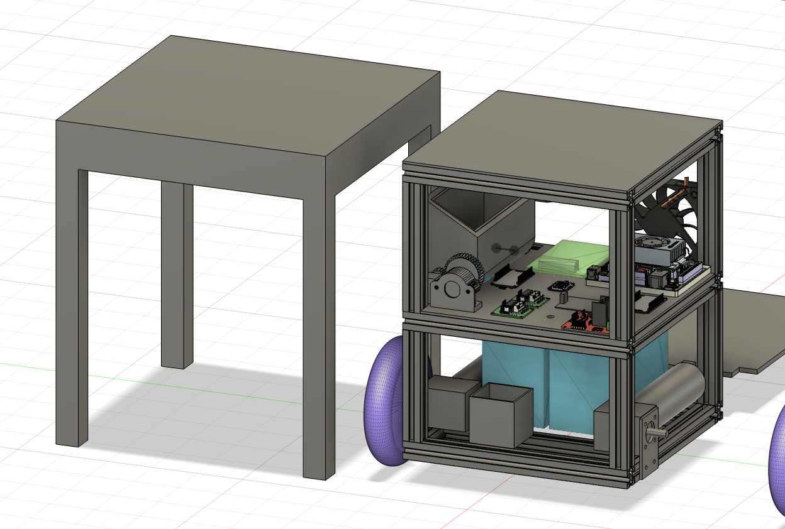
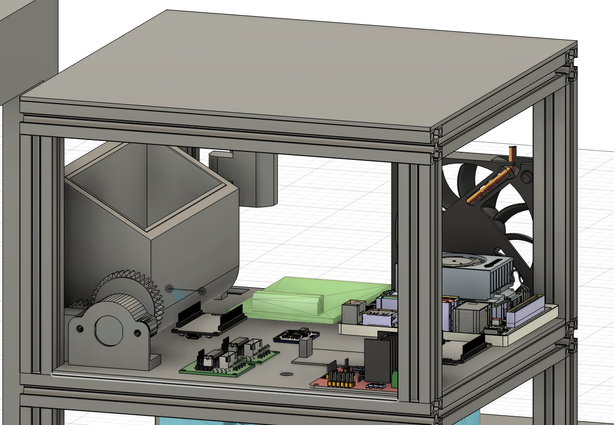
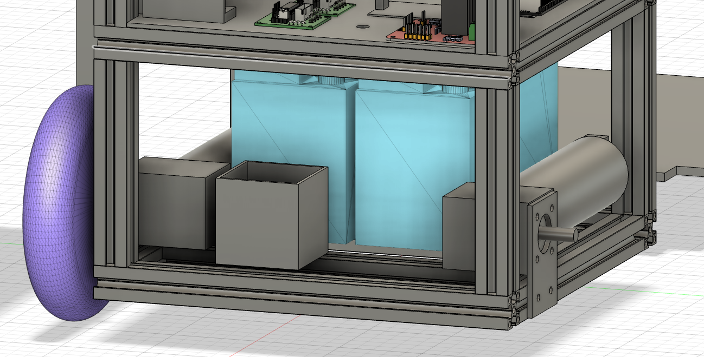

# BnW 통합 로봇 모델

BnW 활동에서 제작한 로봇의 전체 시스템을 하나로 조립해 검토한 3D 모델입니다. 프레임, 구동부, 전원부, 제어 부품과 작업 장치의 배치를 함께 확인할 수 있도록 구성했습니다.

## 모델링 목적

각 부품을 전체 모델에 조립함으로써 제작 전에 부품 간 간섭을 확인하고 최소화했습니다. 프레임 내부 공간을 층별로 나누어 기능별 부품을 분리하고 배치를 검토했습니다.

## 격층 구조

프레임을 상부와 하부 공간으로 구분해 전원부와 다른 부품을 분리했습니다. 상부에는 제어 보드, 구동 모듈과 관련 부품을 배치해 전체 연결 구조와 간섭 여부를 확인했습니다.

## 하단 배터리 배치

무게가 큰 배터리를 프레임 하단에 배치해 로봇의 무게중심을 낮췄습니다. 배터리와 하부 구동부가 차지하는 공간을 전체 조립 모델에서 함께 검토했습니다.

## 주요 설계 포인트

- 전체 조립 모델을 이용한 부품 간 간섭 검토
- 상·하부 격층 구조를 통한 기능별 공간 분리
- 전원부와 제어·구동 부품의 배치 구분
- 무거운 배터리의 하단 배치를 통한 낮은 무게중심
- 실제 제작과 조립을 고려한 프레임 내부 공간 활용

## 관련 BnW 세부 모델

- [캠 거치대](../cam-mount/)
- [옆면 쓰레기 개폐 장치](../side-waste-bin-mechanism/)
- [모터 브라켓](../motor-bracket/)
- [로봇팔 거치대](../robot-arm-mount/)
- [로봇팔 엔드 이펙터](../robot-arm-end-effector/)

## 파일

현재 전체 조립 및 내부 배치 모델링 화면 이미지 3장을 수록했습니다. Fusion 360 원본과 출력용 파일은 추후 추가할 예정입니다.
