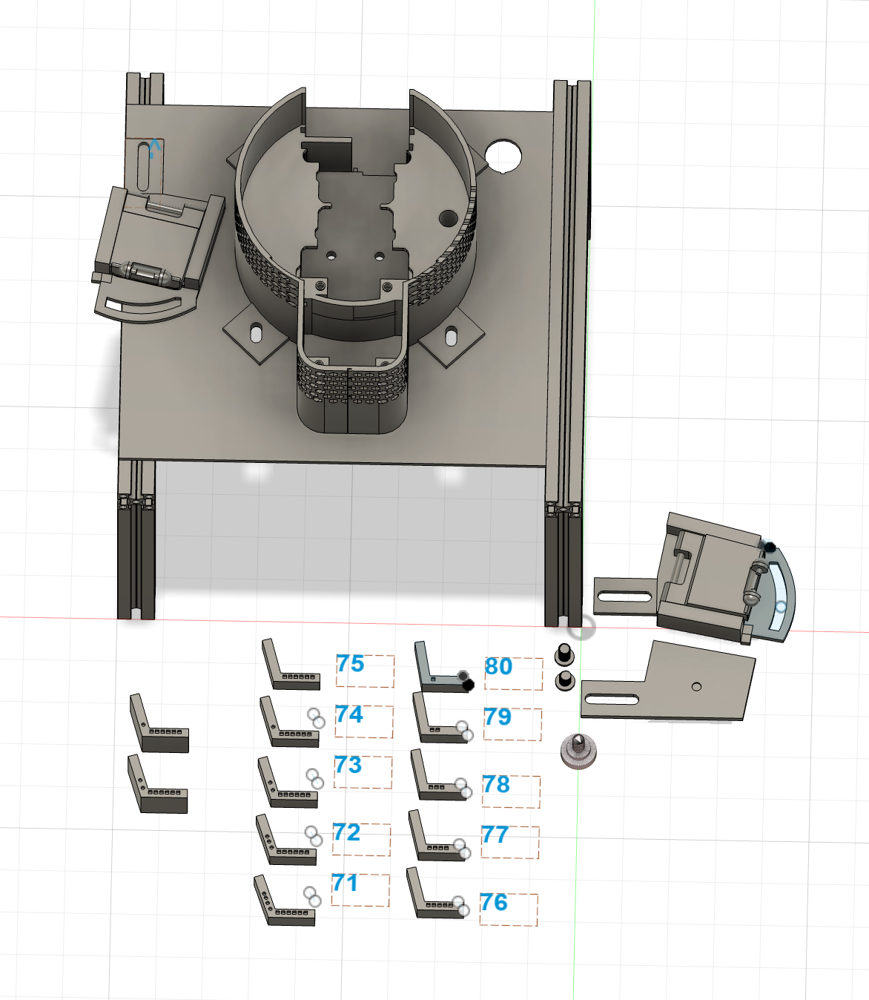
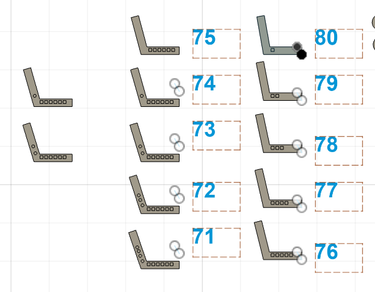
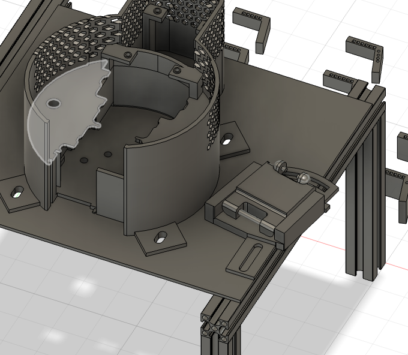

# 캠 거치대

BnW 활동 중 설계한 조절식 캠 거치대입니다.

## 설계 목적

캠을 원하는 방향으로 고정하면서 설치 환경에 맞는 촬영 각도를 찾을 수 있도록 제작했습니다.

## 설계 과정

적정 설치 각도를 찾기 위해 **71°부터 80°까지 서로 다른 각도의 브라켓**을 모델링해 비교했습니다. 하나의 각도를 바로 확정하지 않고 여러 후보를 만들어 실제 설치에 적합한 각도를 검토할 수 있도록 했습니다.

## 주요 기능

- 여러 각도의 교체형 브라켓을 이용한 설치 각도 검토
- 곡선 홈을 이용한 캠의 좌우 각도 조절
- 조절 후 체결 부품으로 위치 고정

## 모델링 포인트

곡선 형태의 장공을 적용해 체결 위치를 따라 캠 방향을 좌우로 조절할 수 있도록 설계했습니다. 각도별 브라켓과 좌우 조절부를 함께 사용해 설치 환경에 맞춰 방향을 조정할 수 있습니다.

## 파일

현재 모델링 화면 이미지 3장을 수록했습니다. Fusion 360 원본과 출력용 파일은 추후 추가할 예정입니다.
