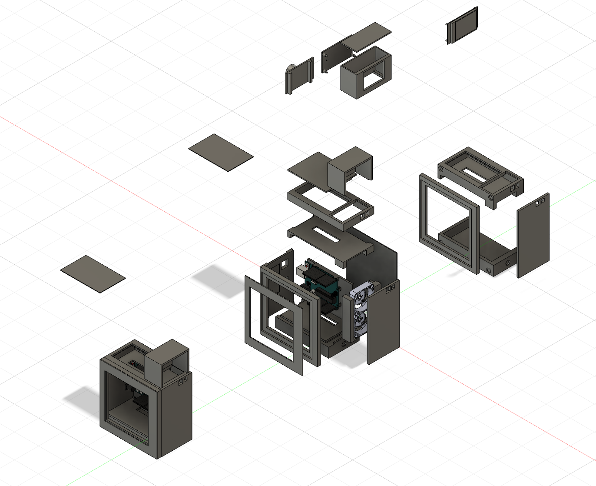
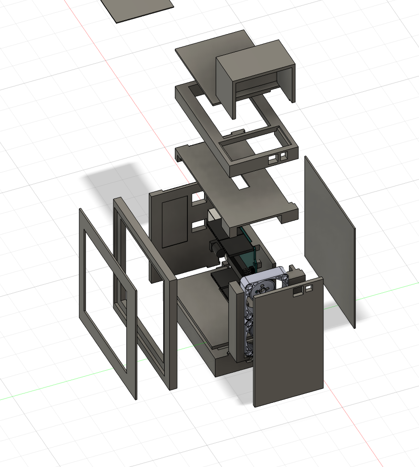

# Claude 사용량 모니터

남은 Claude 사용량을 별도의 장치에서 확인하기 위해 Arduino와 소형 디스플레이를 사용해 제작한 개인 프로젝트입니다.

## 제작 목적

컴퓨터를 사용하는 중 Claude의 잔여 사용량을 별도의 화면에서 편리하게 확인할 수 있도록 제작했습니다. 전원 버튼을 누르면 최신 사용량을 동기화해 디스플레이에 표시하도록 구성했습니다.

## 주요 기능

- Arduino를 이용한 장치 제어
- 소형 디스플레이를 통한 잔여 Claude 사용량 표시
- 전원 버튼 입력을 통한 최신 사용량 동기화
- 전면 팬 ON/OFF 제어
- 컴퓨터 본체를 본뜬 데스크톱 하우징

## 하우징 디자인

소형 컴퓨터 본체를 콘셉트로 전면 프레임, 측면 패널, 상단 패널과 내부 지지 구조를 각각 모델링했습니다. 전면에는 팬을 배치하고 외부에서 조작할 수 있는 버튼과 디스플레이 장착부를 구성했습니다.

## 내부 구성

하우징 내부에 Arduino, 디스플레이, 전면 팬과 제어 부품을 배치할 수 있도록 각 부품의 장착 공간을 설계했습니다. 패널을 여러 부분으로 나눠 내부 조립 구조를 확인할 수 있도록 구성했습니다.

## 작동 흐름

1. 장치의 전원 버튼을 누릅니다.
2. 장치가 최신 Claude 사용량을 동기화합니다.
3. 남은 사용량을 디스플레이에서 확인합니다.
4. 필요에 따라 전면 팬을 켜거나 끕니다.

## 파일

현재 모델링 화면 이미지 2장을 수록했습니다. Fusion 360 원본과 출력용 파일은 추후 추가할 예정입니다.

