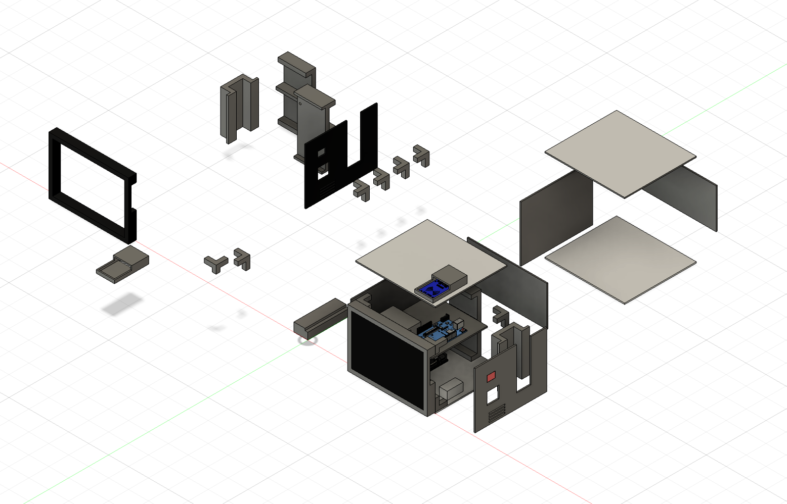
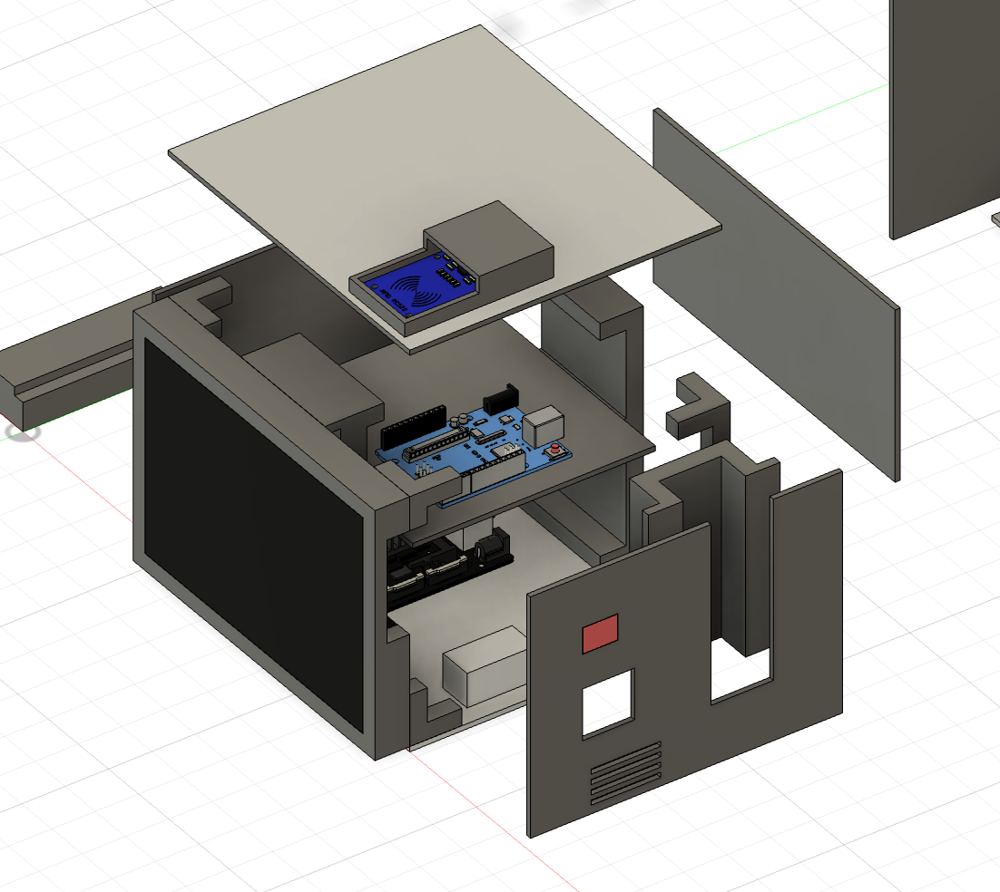

# 건강 체크 박스

전공 프로젝트로 진행한 개인 건강 상태 확인용 데스크톱 장치입니다. 사용자 인증, 생체 신호 확인, 카메라 관찰 및 GPT API 연동 기능을 하나의 하우징에 통합할 수 있도록 설계했습니다.

## 설계 목적

사용자가 자신의 계정으로 로그인한 뒤 전면 터치 패널을 통해 건강 상태를 확인할 수 있도록 구성했습니다. 카드 기반 로그인, 심박수 확인, 카메라를 이용한 표정·자세 관찰 기능도 함께 사용할 수 있도록 각 모듈의 장착 위치를 설계했습니다.

## 사용자 인증

- 전면 터치 패널을 이용한 계정 로그인
- 상단 NFC 모듈과 카드를 이용한 사용자 인증
- 인증된 사용자의 건강 상태 확인 화면 제공

## 건강 상태 확인 기능

- 측면 심박수 체크 모듈
- 카메라를 이용한 표정 및 자세 확인
- GPT API와 연동한 건강 상태 분석 및 안내 보조

## 하우징 및 내부 배치

전면에는 터치 패널을 배치하고, 상단에는 NFC 모듈을 장착할 수 있도록 구성했습니다. 내부에는 제어 보드와 관련 부품을 층별로 배치하고, 측면과 전면 패널에는 센서 및 카메라를 위한 개구부를 반영했습니다.

## 주요 특징

- 여러 전자 모듈을 하나의 하우징에 통합한 구조
- 조립과 내부 접근을 고려한 분할 패널 설계
- 터치 및 NFC를 활용한 두 가지 로그인 방식
- 생체 신호와 영상 정보를 함께 확인하는 구성

## 참고 사항

이 프로젝트는 건강 상태를 확인하고 안내를 보조하기 위한 전공 프로젝트입니다. 의료기기로서의 성능이나 실제 질환 진단 능력이 검증되었다는 정보는 포함하지 않습니다.

## 파일

현재 모델링 화면 이미지 2장을 수록했습니다. Fusion 360 원본과 출력용 파일은 추후 추가할 예정입니다.

