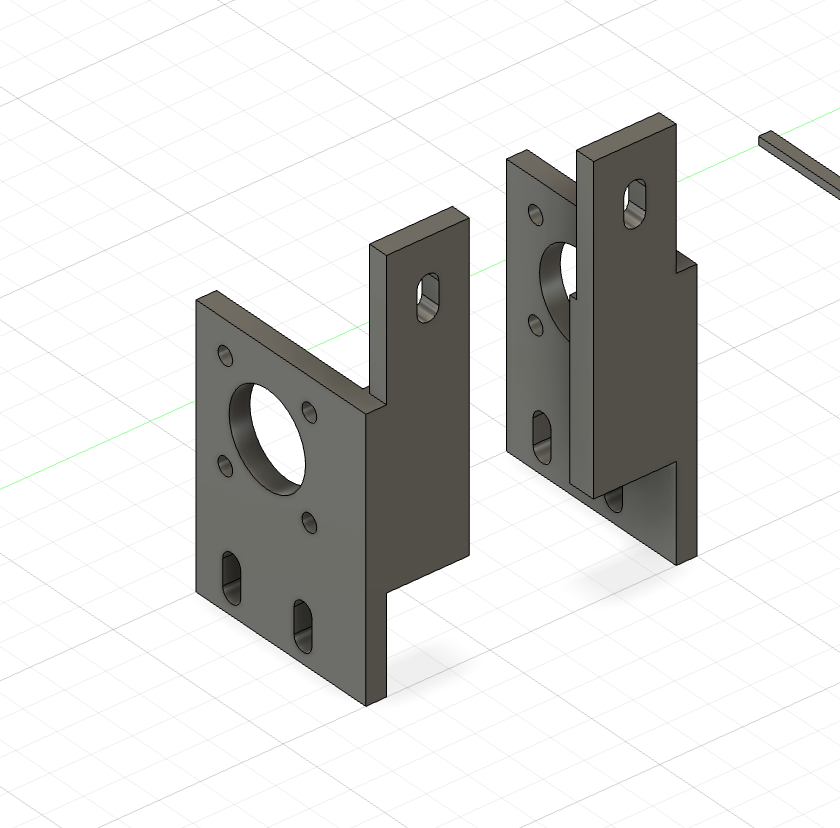
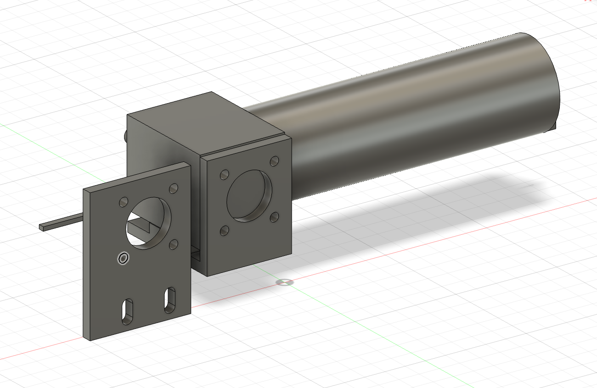
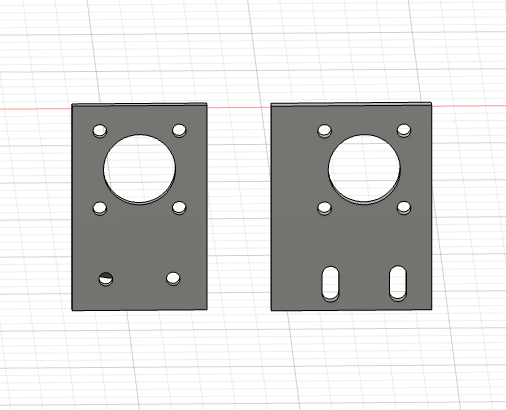

# 모터 브라켓

BnW 활동에서 알루미늄 프로파일 프레임에 모터를 장착하기 위해 설계한 맞춤형 브라켓입니다.

## 설계 목적

알루미늄 프로파일로 제작한 프레임에 모터를 안정적으로 결합할 수 있도록 전용 브라켓을 제작했습니다. 프레임 구조와 모터의 장착부에 맞춰 브라켓 형상과 체결 위치를 구성했습니다.

## 진동 문제 개선

모터 작동 중 발생하는 진동으로 장착부가 흔들릴 가능성을 고려했습니다. 브라켓을 프레임의 **세 지점에 고정**하는 구조로 설계해 지지력을 높이고 진동으로 인한 움직임을 줄였습니다.

## 주요 특징

- 알루미늄 프로파일 프레임에 맞춘 전용 브라켓
- 모터 장착 홀과 중심축 통과부 구성
- 세 지점 체결을 통한 흔들림 및 진동 억제
- 장착 위치 조정을 고려한 장공 적용

## 형상 검토

모터 장착부의 기본 홀 배열을 유지하면서, 프레임 체결 방식에 맞게 하단 고정부 형상을 비교하고 조정했습니다.

## 파일

현재 모델링 화면 이미지 3장을 수록했습니다. Fusion 360 원본과 출력용 파일은 추후 추가할 예정입니다.
