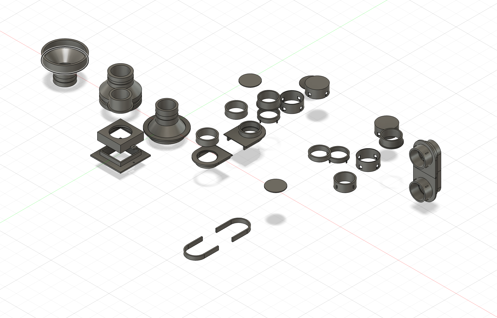
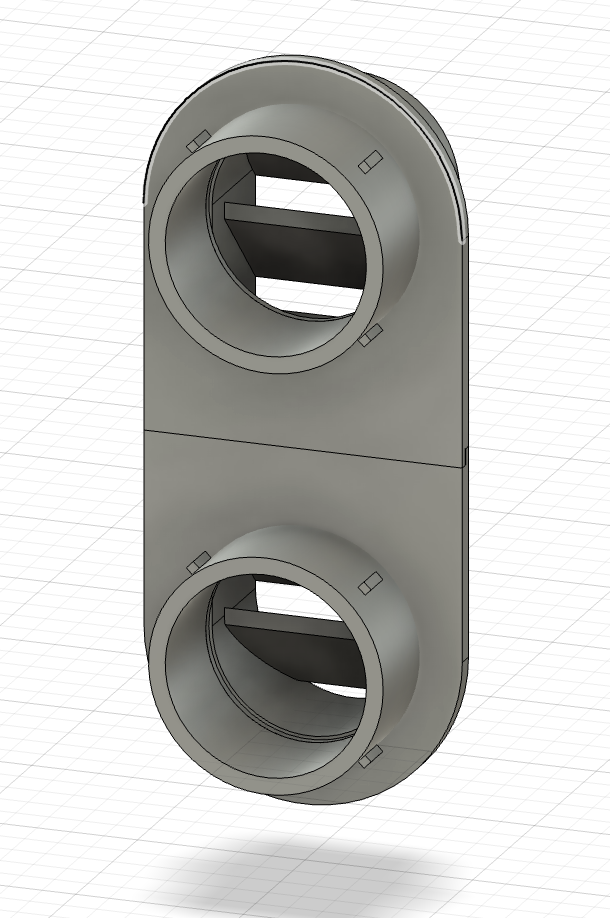
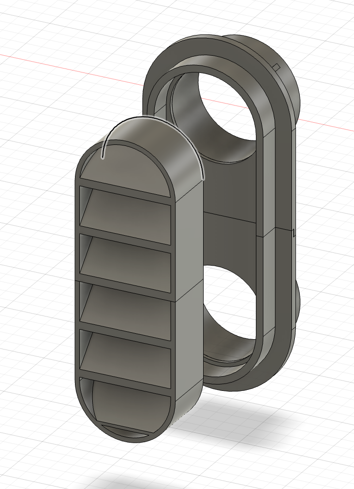
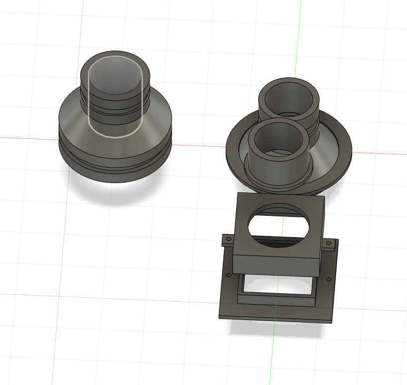
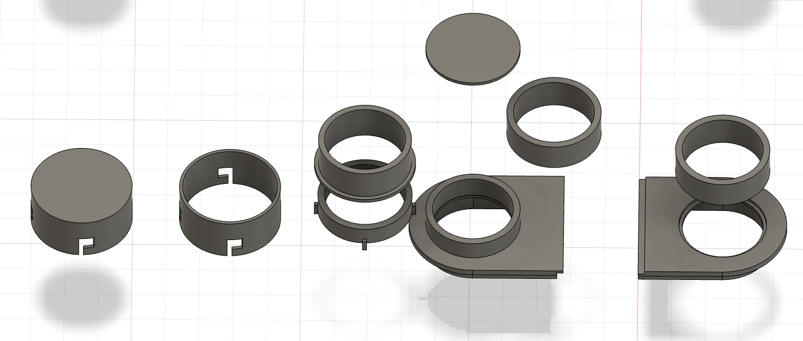

# 탈부착식 창문 환기팬

가정에서 필요한 때에만 창문에 설치해 사용할 수 있도록 전용 브라켓과 빗물막이를 설계하고 3D 프린팅한 개인 프로젝트입니다.

## 제작 목적

3D 프린터 챔버를 운용하거나 납땜 작업을 할 때 실내 공기를 창문 밖으로 배출하기 위해 제작했습니다. 창문에 고정 설치하지 않고 상황에 따라 환기팬을 장착하거나 분리할 수 있도록 구성했습니다.

## 주요 특징

- 창문에 맞춰 설계한 전용 장착 브라켓
- 필요할 때 설치하고 보관할 수 있는 탈부착 구조
- 외부 빗물 유입을 줄이기 위한 커버
- 환기팬과 덕트를 연결하기 위한 모듈형 어댑터
- 3D 프린터 챔버 환기와 납땜 작업에 공용으로 사용

## 빗물막이 구조

창문 바깥쪽의 배출구를 덮어 빗물이 직접 들어오는 것을 줄일 수 있도록 커버를 설계했습니다. 두 개의 원형 포트를 배치한 형상과 전면에 가로 차단부를 적용한 형상을 함께 검토했습니다.

## 창문 장착부와 덕트 연결

창문에 고정되는 사각 브라켓과 원형 덕트 변환부를 별도로 구성했습니다. 연결 부품을 나누어 설계해 설치 환경과 덕트 구성에 맞는 조합을 검토할 수 있도록 했습니다.

## 설계 과정

덕트 직경과 배출 방향, 연결 방식에 맞춰 여러 형태의 링, 캡, 어댑터 및 고정부를 모델링했습니다. 부품을 모듈식으로 나눠 필요한 구성에 따라 조합할 수 있도록 설계를 발전시켰습니다.

## 참고 사항

실제 풍량, 기밀성 및 방수 등급에 대한 측정 정보는 포함하지 않습니다. 납땜 작업에는 작업 물질에 적합한 별도의 안전·환기 대책이 필요할 수 있습니다.

## 파일

현재 모델링 화면 이미지 5장을 수록했습니다. Fusion 360 원본과 출력용 파일은 추후 추가할 예정입니다.

