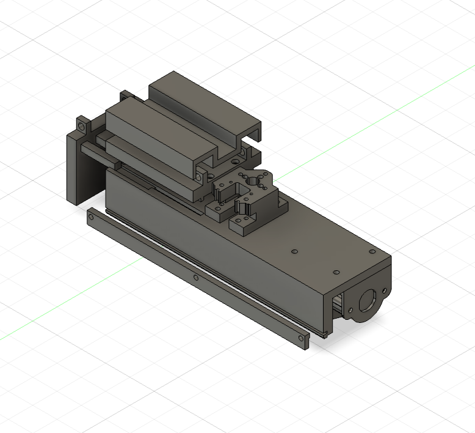
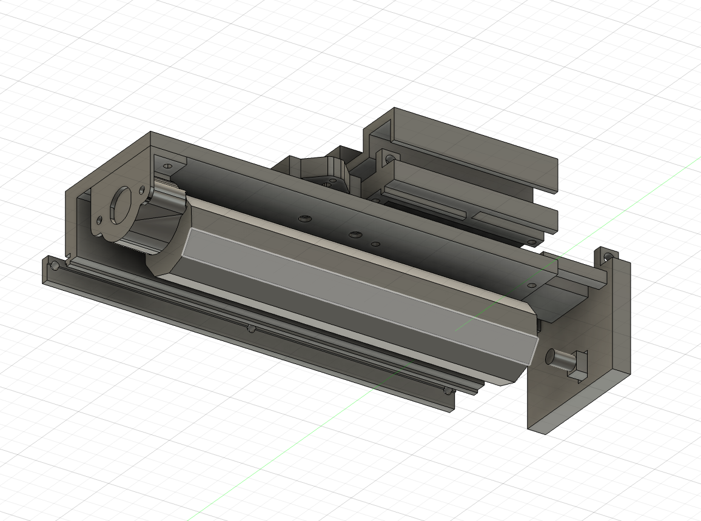
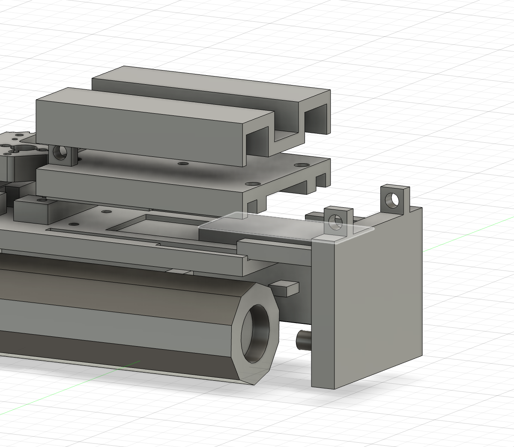

# 로봇팔 엔드 이펙터

BnW 활동에서 닦기와 쓸기 작업을 하나의 장치로 수행하기 위해 설계한 로봇팔 끝단 청소 도구입니다.

## 설계 목적

와이핑 스틱을 간편하게 교체하면서 여러 개의 깨끗한 걸레면을 순차적으로 사용할 수 있도록 설계했습니다. 장치 후면에는 솔을 배치해 한 개의 엔드 이펙터로 닦기와 쓸기 작업을 모두 수행할 수 있습니다.

## 와이핑 스틱 회전 구조

스텝모터를 이용해 와이핑 스틱을 한 번에 **60°씩 회전**시킵니다. 육각 형태의 스틱을 한 면씩 전환해 총 **6개의 걸레면**을 순차적으로 사용할 수 있도록 구성했습니다.

## 주요 특징

- 60° 단위로 위치를 전환하는 스텝모터 구동
- 총 6개의 깨끗한 걸레면 순차 사용
- 스프링 구조를 이용한 와이핑 스틱 교체
- 후면 솔을 활용한 쓸기 기능
- 닦기와 쓸기를 결합한 복합 청소 구조

## 스프링 교체 구조

와이핑 스틱 장착부에 스프링 구조를 적용해 스틱을 손쉽게 분리하고 교체할 수 있도록 했습니다. 반복적인 걸레면 사용과 스틱 교체의 편의성을 함께 고려한 구조입니다.

## 파일

현재 모델링 화면 이미지 3장을 수록했습니다. Fusion 360 원본과 출력용 파일은 추후 추가할 예정입니다.
