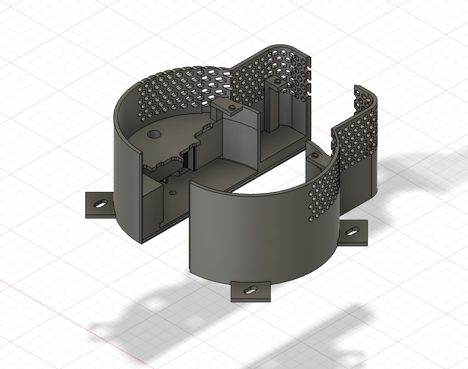
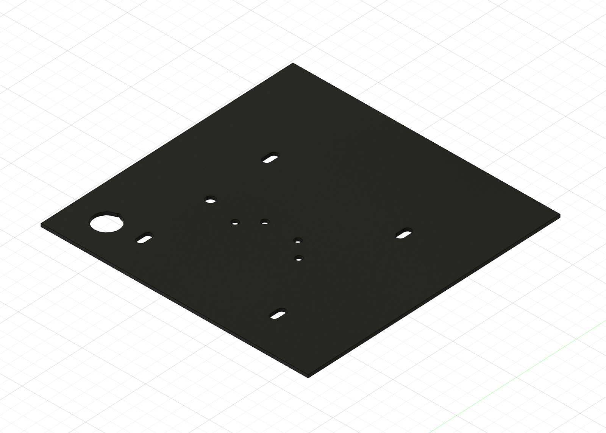
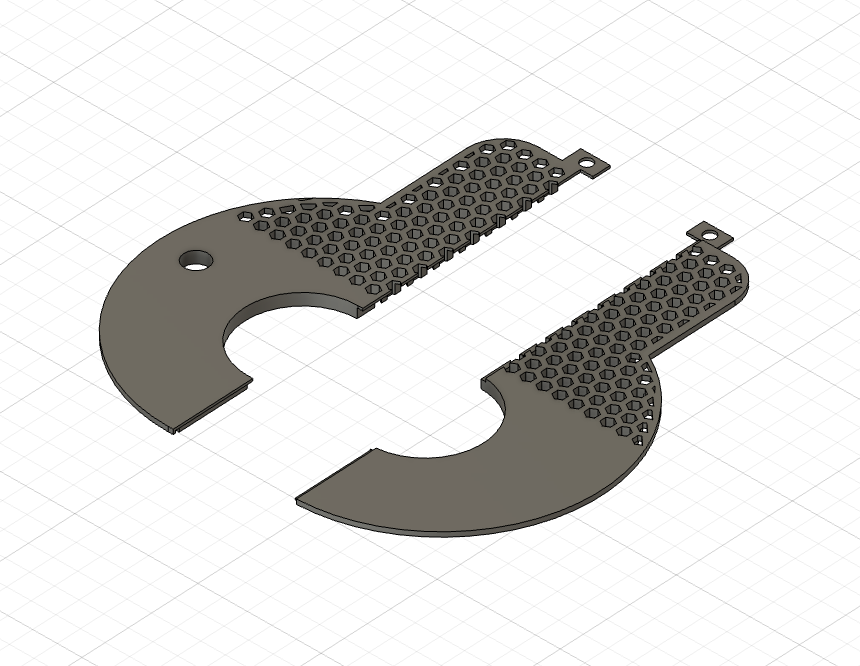

# 로봇팔 거치대

BnW 활동에서 로봇팔을 본체 상판에 고정하고 주변 부품을 함께 수납하기 위해 설계한 거치대입니다.

## 설계 목적

로봇팔을 본체 상판에 안정적으로 고정하면서 외관을 정돈할 수 있도록 로봇팔 하단부를 감싸는 형태로 설계했습니다. 거치대 내부에는 UWB를 내장할 수 있는 공간도 함께 구성했습니다.

## 주요 특징

- 본체 상판에 로봇팔을 고정하는 체결 구조
- 로봇팔 하단부를 감싸는 곡면 외형
- 거치대 내부의 UWB 수납 공간
- 상판과 결합하기 위한 외곽 체결부
- 외관과 개방 구조를 함께 고려한 패턴 적용

## 주문 제작 아크릴 상판

본체 상판은 아크릴로 주문 제작했습니다. 로봇팔 거치대와 각 부품을 정해진 위치에 장착할 수 있도록 원형 홀, 체결 홀 및 장공을 반영해 가공했습니다.

## 하단 커버 구조

로봇팔 하단부를 감싸는 커버를 두 부분으로 구성했습니다. 중앙의 원형 개구부는 로봇팔 하단 형상과 결합되며, 패턴이 적용된 외곽부가 거치대의 외형을 완성합니다.

## 파일

현재 모델링 화면 이미지 3장을 수록했습니다. Fusion 360 원본과 출력용 파일은 추후 추가할 예정입니다.

