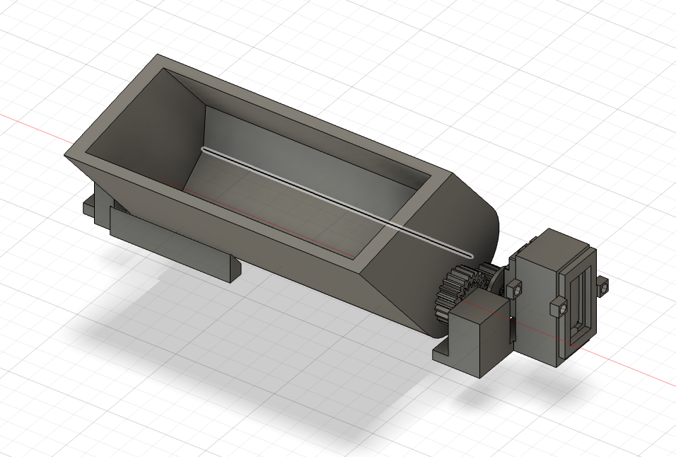
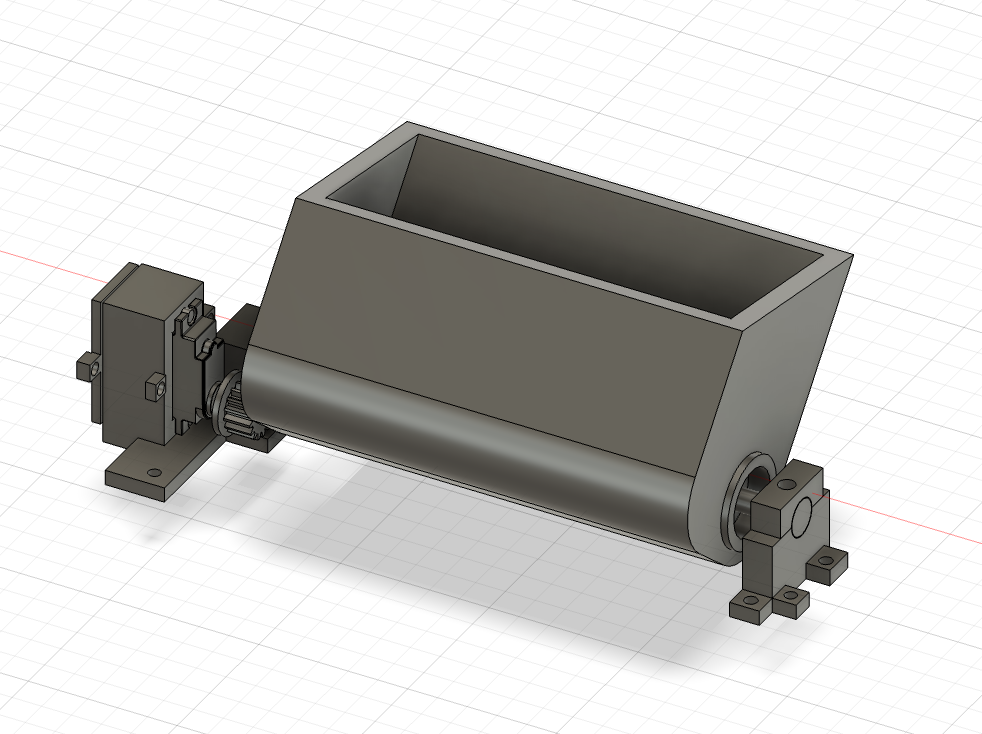
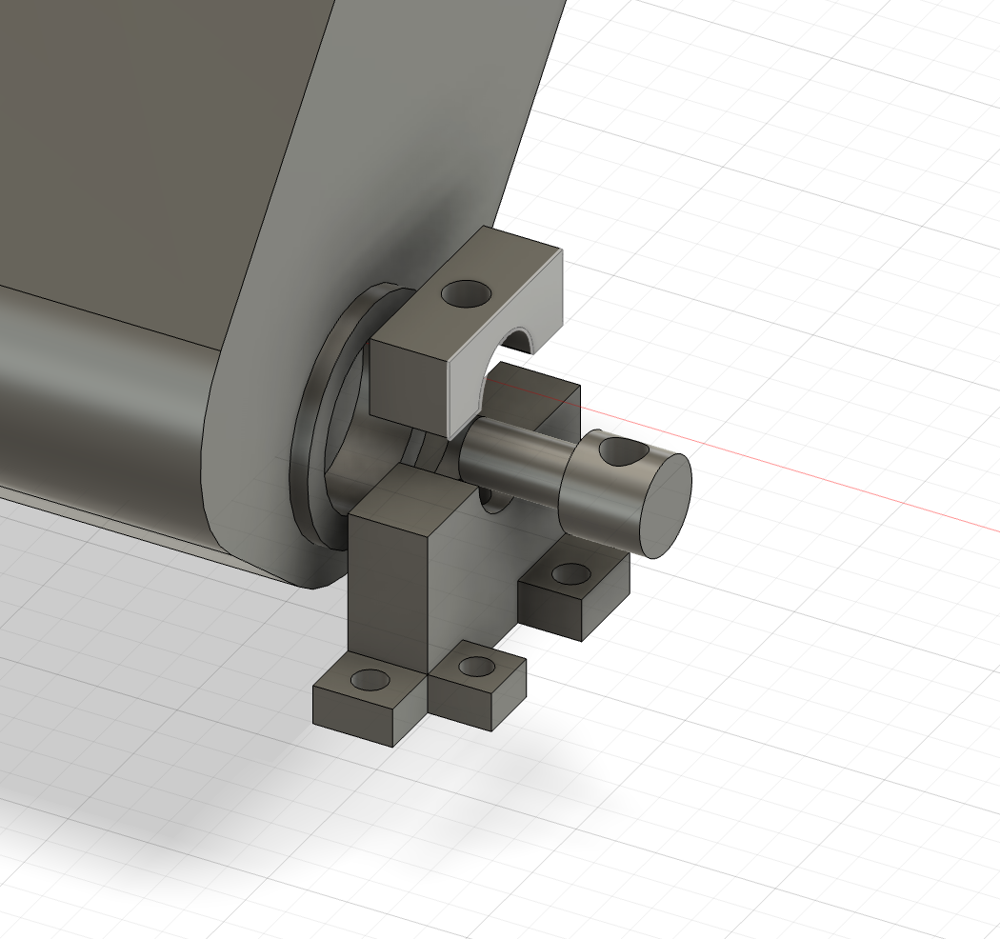
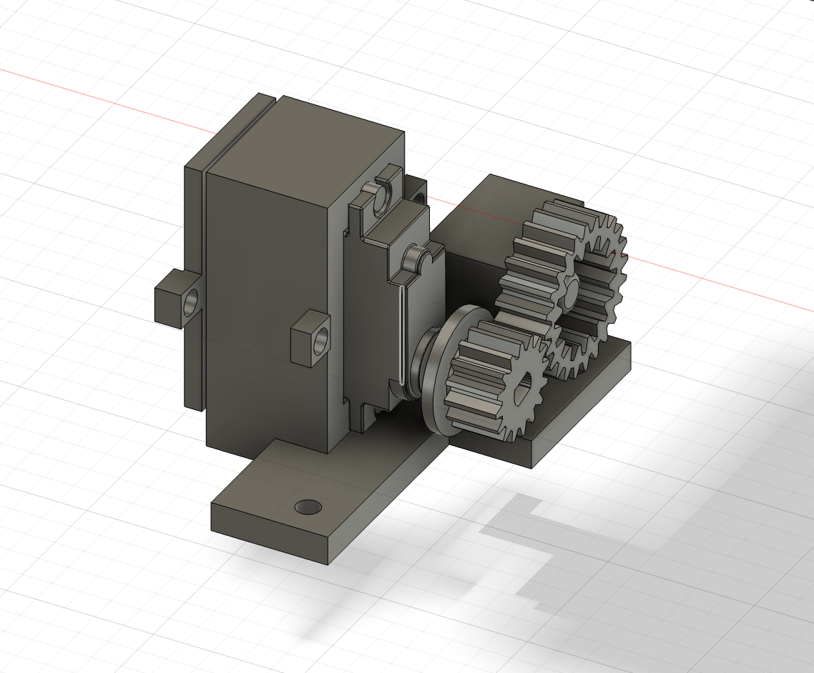

# 옆면 쓰레기 개폐 장치

BNW 활동 중 본체 옆면에 쓰레기통을 내장하기 위해 설계한 회전식 개폐 장치입니다.

## 설계 목적

청소를 진행할 때 본체 옆면의 쓰레기통을 열어 쓰레기를 바로 담을 수 있도록 설계했습니다. 사용 후에는 본체 측면에 수납할 수 있으며, 내부 쓰레기통을 별도로 분리해 편리하게 비울 수 있습니다.

## 작동 방식

서보모터의 회전력을 기어를 통해 쓰레기통의 회전축으로 전달합니다. 쓰레기통은 양쪽 축을 기준으로 회전하며 열리고 닫히는 구조입니다.

## 주요 기능

- 서보모터와 기어를 이용한 개폐 구동
- 축을 중심으로 회전하는 쓰레기통 구조
- 본체 옆면에 수납되는 일체형 배치
- 쉽게 비울 수 있는 분리형 이너 쓰레기통
- 정비와 교체를 고려한 탈부착 구조

## 회전축 및 장착 구조

쓰레기통 양쪽에 회전축과 지지부를 배치했습니다. 장착부는 체결 위치에 접근하기 쉽도록 구성해 쓰레기통 모듈을 분리하거나 다시 장착하기 편리하도록 설계했습니다.

## 서보모터 및 기어 구동부

서보모터와 여러 기어를 조합해 회전축을 구동하는 구조입니다. 기어 구동부와 모터 장착부를 하나의 모듈로 구성해 본체에 고정할 수 있도록 했습니다.

## 파일

현재 모델링 화면 이미지 4장을 수록했습니다. Fusion 360 원본과 출력용 파일은 추후 추가할 예정입니다.

